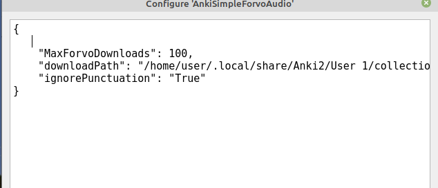

# Installation
Either clone this repository to your Anki-Addons folder or download the zip in [Releases](https://github.com/Rascalov/Anki-Simple-Forvo-Audio/releases), unzip it, and put in your addon folder

You should be good to go. But should the audio not play, you might need to set the download path:

* Go to Anki>Tools>Add-ons  
* Select the addon
* Click on **Config**
* set your `downloadPath` to the path anki uses to save media 

On linux, mine looked like:  
`/home/user/.local/share/Anki2/User 1/collection.media/`

On windows you need to use forward slashes or double backslashes for your path, otherwise the program will return an invalid configuration error message. Eg.
 
`C:\\Users\\Administrator\\AppData\\Roaming\\Anki2\\yourankiaccountname\\collection.media`

**Result**:  
**On Linux**  

**On Windows**
 

# Anki Simple Forvo Audio
Main goal of this addon is to make forvo audio easy to apply to your anki cards (and doing so for **free** ). 
No forvo account is needed.

AwesomeTTS supports forvo, but only if you pay for an API key or subscribe to their patreon.   I wrote this to avoid monthly payments.

The addon has 2 functionalities:

## Select and fetch
Gif should make it straightforward. Select your word, rightclick on * Add Forvo Audio*.  
This brings you to a pop up where you can quickly search for your word, choose your language, and the destination field.

You can also also preview the audios before you choose one.  

## Auto Fetch (Safe)
You can find it in `tools>Add Forvo TTS to deck`  
It takes in a deck and, depending on the fields you select, downloads audios from either forvo or my own CDN that uses forvo when needed. 
It can save you some time and effort on large decks

