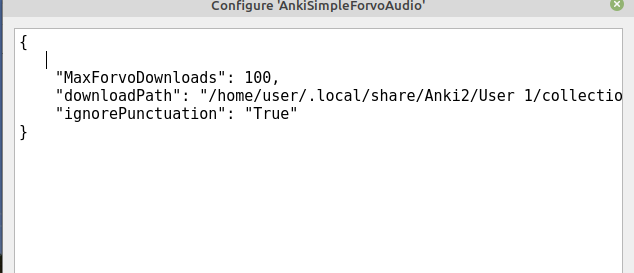

# Installation methods

## (Easy) From the Anki Add-ons collection
- Open Anki on your computer
- Go to the Tools->Add-ons menu item
- click on **Get Add-ons** and paste in the code.
>560814150
- Restart your Anki and you're good to go.


## (Tedious) From the repository source

Either clone this repository to your Anki-Addons folder or download the zip in [Releases](https://github.com/Rascalov/Anki-Simple-Forvo-Audio/releases), unzip it, and put in your addon folder

You should be good to go. But should the audio not play, you might need to set the download path:

* Go to Anki>Tools>Add-ons <br>
* Select the addon
* Click on **Config**
* set your `downloadPath` to the path anki uses to save media 

On linux, mine looked like: <br>
`/home/user/.local/share/Anki2/User 1/collection.media/`

On windows you need to use forward slashes or double backslashes for your path, otherwise the program will return an invalid configuration error message. Eg.
<br>
`C:\\Users\\Administrator\\AppData\\Roaming\\Anki2\\yourankiaccountname\\collection.media`

**Result**: <br>
**On Linux** <br>


**On Windows**
<br>


# Anki Simple Forvo Audio
Main goal of this addon is to make audio easy to apply to your anki cards (and doing so for **free**).<br>
No forvo account is needed.

AwesomeTTS supports forvo, but only if you pay for an API key or subscribe to their patreon. <br> I wrote this to avoid monthly payments.

The addon has 2 functionalities:

## Select and fetch
Gif should make it straightforward. Select your word, rightclick on * Add Forvo Audio*. <br>
This brings you to a pop up where you can quickly search for your word, choose your language, and the destination field.

You can also also preview the audios before you choose one.  

## Auto Fetch (Safe)
You can find it in `tools>Add Forvo TTS to deck` <br>
It takes in a deck and, depending on the fields you select, downloads audios from the CDN.<br>
It can save you some time and effort on large decks


### How a field is read

A field is rarely one word. `Не р<u>а</u>з (= много раз)<br>Мы не раз ходили в это кафе.`
is a headword, a gloss and an example sentence, so the field is cut into
segments before anything is looked up:

* the **first line** holds the headword. It is looked up whole first, because
  one recording of `не за что` beats three recordings of `не`, `за` and `что`.
  Only if the phrase is not there is it covered by the longest pieces that are
  (`местная газета` → `местная` + `газета`).
* **later lines** are looked up whole and nothing else. They are added when the
  CDN has them (`Спасибо`, `пенсионерка`) and skipped when it does not.
  Textbook example sentences are not on the CDN, and one stitched together out
  of seven different speakers is worse than no audio at all.
* glosses (`(= много раз)`, `(ontelbaar)`, `(m)`), `[sound:…]` tags, table
  labels ending in `:` and edge punctuation are dropped. Aspect pairs written
  `решать – решить` or `убивать/убить` become two headwords.

Nothing is capped: a field collects a recording for every part of it the CDN
has, so a note carrying a full conjugation table gets one per form.
`coverHeadwordsUpToWords` (default 6) is the longest headword still worth
covering word by word; past that it is treated as a sentence.

### Accents and stress marks

The CDN matches exactly, so the spelling sent to it has to be the one the
recordings were filed under, and that differs by language:

* in French, Spanish or Greek an accent **is** the spelling. `élève` has
  recordings, `eleve` has none, so accents are kept (and recomposed to NFC).
* in Russian and its neighbours a combining acute only marks stress for
  learners. `место` has recordings, `ме́сто` has none, so the mark is removed.
  `ё` is a letter rather than an accent and survives — `её` has recordings,
  `ее` has none.
* stress written as markup (`Н<u>е</u>когда`) or as a capital (`очкОв`) is
  handled too.

## Audio sources
Audio is served by the [forga](https://forga.charitycook.com) CDN.
When the CDN has no result, the addon falls back to external sources
(lingua libre, and openrussian for Russian) if the `Use fallback sources`
config option is enabled. Direct scraping of forvo.com is no longer supported.

### OpenRussian (Russian only)
For Russian words neither the CDN nor lingua libre has, the addon falls back
to [openrussian](https://en.openrussian.org), which generates audio for any
word. In the manual search dialog it is only ever offered when no other source
matched. In the automated deck run (`Tools > Add Forvo TTS to deck`) it is
controlled by the **"Use OpenRussian for missing audio"** checkbox (off by
default): when ticked, a two-word phrase the CDN does not have whole may
still be stitched from its words (the missing one filled in from
openrussian), while anything longer is taken from openrussian as one piece —
a sentence is never built out of single words.

The source needs a logged-in session: set your `openrussianUsername` and
`openrussianPassword` in the config (or paste an `openrussianSession` cookie
value) and the addon logs in for you.

## Running the tests

The text handling and the lookup policy are pure, so they run without Anki:

```
cd tests && python -m unittest discover
```
